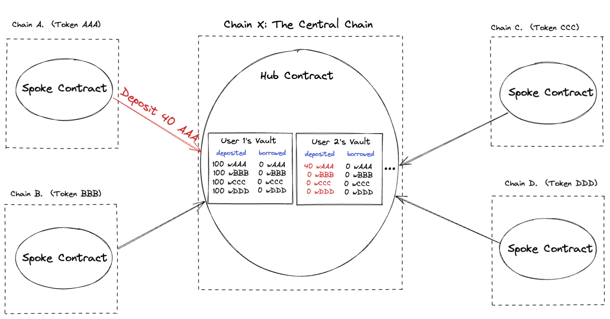
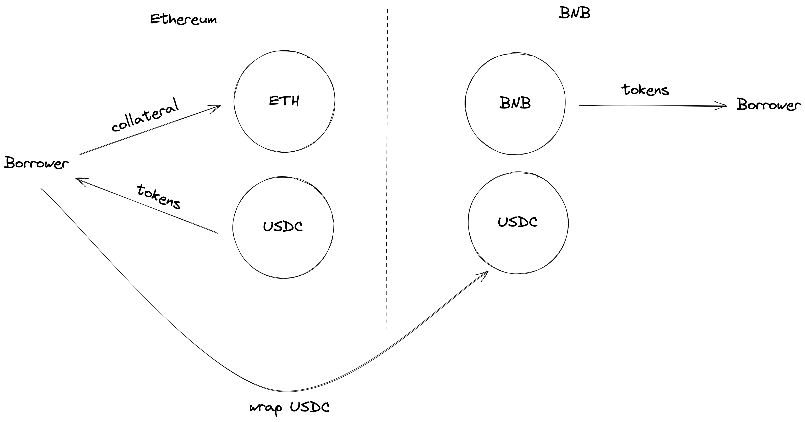
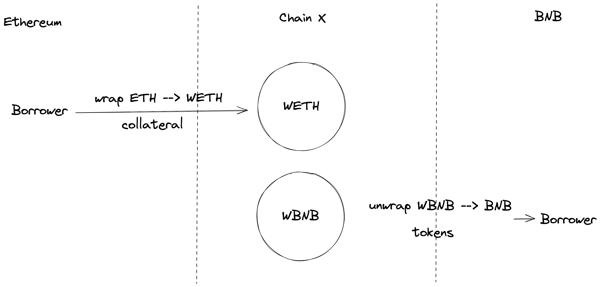
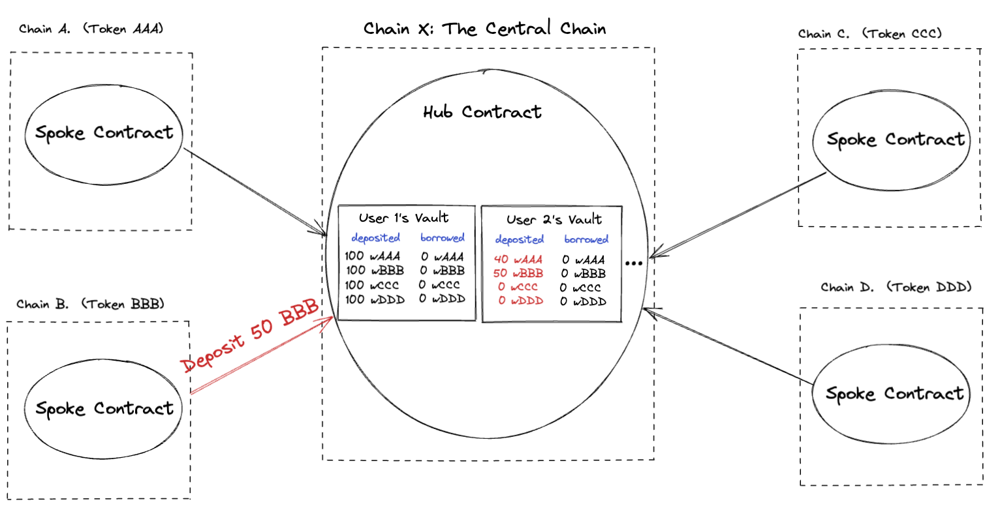
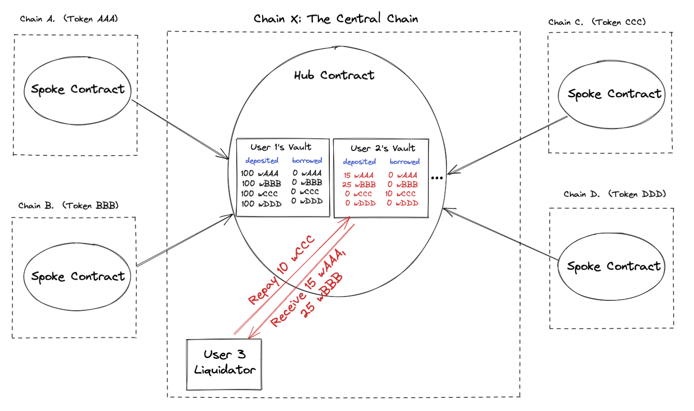

**WARNING**: This repository has not been audited, so it may contain bugs and should be used for example purposes only. If you intend to use or build on this example to perform actual lending, it's highly recommended that you have the final code commit audited by a smart contract auditing firm.

# Setup

## Running tests in localnet

To run tests on this reference example suite, you will need to [install yarn](https://classic.yarnpkg.com/lang/en/docs/install/#mac-stable).

After installing yarn, you should:

1. Navigate to the 'example-2/evm' folder.
2. run `make build`--This will install Forge (a standard EVM development toolkit that allows tests to be written in Solidity) and the necessary node modules. It will also compile the smart contract code.
3. run `make test`--This will compile and then run all the tests, which are defined in `example-2/evm/test/Hub.t.sol`. This will take a bit the first time and should print the results of the tests as well as some logs output in the terminal.

## Cross-chain design and testing in localnet

The `make test` command references the `Makefile` and runs the [`forge test`](https://book.getfoundry.sh/forge/tests) command as defined in the `Makefile`. For the purposes of simulating and testing hubs and spokes on localnet, the current codebase does not spin up different networks and interface across them. Instead, it uses the same network for the hub and all the spokes and registers each with a specific chain ID. Messages to particular spokes are then routed to those spokes via a forked Wormhole contract that simulates the Wormhole network but with one guardian that signs using the key stored in the `TESTING_DEVNET_GUARDIAN` environment variable. This simulates the Wormhole cross-chain connectivity by replicating the normal VAA construction, without requiring spinning up multiple local networks. This setup was adapted from the [Wormhole scaffolding repo](https://github.com/wormhole-foundation/wormhole-scaffolding/tree/main/evm).

All environment variables are defined in `testing.env`. In addition to the guardian key, the tests fork the [Wormhole core contract](https://book.wormhole.com/reference/contracts.html#core-bridge) and [Token Bridge contract from mainnet](https://book.wormhole.com/reference/contracts.html#token-bridge) (in the current codebase, from Avalanche), set the guardian set index to represent the one guardian Wormhole testing framework leveraged on localnet, set the Wormhole chain ID, and fork the [Pyth contract](https://docs.pyth.network/pythnet-price-feeds/evm#mainnet) from mainnet. All this is done in the `testSetUp` function found in `example-2/evm/test/helpers/TestHelpers.sol`. forge enables forking the existing EVM mainnet environment by setting a `fork-url` flag equal to an RPC endpoint from which to fork state.

## Tips for deploying and testing on different chains on devnet/testnet

Deploying and testing on a devnet/testnet environment would involve different steps than the localnet setup outlined above. One would not need to deploy the Wormhole core, Token Bridge, or Pyth contracts, since they could leverage the existing official contracts on devnet/testnet. One would need to deploy the hub on a single network and the spoke on as many chains as they wanted. [The Foundry Book](https://book.getfoundry.sh/forge/deploying) has some helpful instructions on deploying contracts.

Note that there is currently no cross-chain relayer infrastructure in place around these contracts. To actually run the protocol in practice, one may want to build in relayer capabilities, either by building out and operating a bespoke relayer for this application or by connecting to generic relayer infrastructure. More details on relayers can be found in the [Wormhole book](https://book.wormhole.com/wormhole/6_relayers.html). 

# Cross Chain Borrow Lend Hub and Spoke Docs

We propose a design and reference example (EVM only) for a Cross-chain borrow lend protocol, using a Hub and Spoke model.

Users can deposit assets into the protocol. They can also borrow assets from the protocol, using the assets that they have deposited as collateral. The protocol keeps track of the amount of each asset a user has deposited, and the amount of each asset a user has borrowed. We will often refer to a user’s deposited and borrowed assets in the protocol as their ‘vault’.

Users can also repay assets (returning some or all of their borrowed assets) and withdraw assets (retaking some or all of their deposited assets).

Users can also liquidate other users if the other user’s borrowed assets are worth more than their deposited assets. We use Pyth prices to determine value of assets. 

We store all state on the Hub chain, and have a Spoke contract deployed on each spoke chain, so that users on any chain can perform the deposit, borrow, withdraw, and repay actions through the corresponding Spoke contract.



## Table of Contents

1. Preface
2. Setting up the Hub and Spoke
3. User Functions
4. Illustration of User Functions
5. Keeping Track of Interest
6. Collateralization Ratios
7. Prices - Pyth Oracle Integration
8. Decimal Considerations
9. Protocol Design Choices

## 1. Preface

- Why Cross Chain?
    
    The rationale for cross-chain borrow-lend in particular is not very different from that for general cross-chain applications. Users want to interact with applications without having to migrate to a particular chain to do so, and many will just choose the easiest application to interact with from their native wallet—as opposed to the best one from a protocol design perspective.
    
    Similar to the famous real-estate saying, the success of a DeFi application is intimately tied to “liquidity, liquidity, liquidity”. Cross-chain applications enable users native to many different chains to pool their liquidity on one application, instead of fragmenting it across multiple applications, each siloed to one chain. Borrow-lend user experience is predominantly a function of liquidity available, so cross-chain makes a lot of sense for this particular use case.
    
- Why Hub and Spoke?
    
    A point-to-point model of cross-chain borrow-lend could keep every chain identical in function and allow accounting between any pair of chains. Assets would be kept on native chains, without any wrapping, and Wormhole messages would be used to facilitate only accounting between chains. A skeleton reference example for this type of model can be found at this [repo](https://github.com/wormhole-foundation/example-wormhole-lending/tree/main/example-1/evm), which demonstrates collateral deposits on BNB and borrowing on Ethereum. A schematic for this type of design can be seen below:
    
    
    
     
    
    Meanwhile, a hub-and-spoke model features a single hub chain that functions as either a centralized accounting or liquidity layer, with different spoke chains sending either accounting messages (centralized accounting) or wrapped token transfers (centralized liquidity) upon token movements to the hub. The hub then serves as the authoritative source of state information, and any state stored on spokes is meant to be a copy of the ground truth state stored on the hub. Below, we motivate the hub-and-spoke model by examining some challenges with other models.
    
    The point-to-point model is relatively simple in schema, but interest rate calculation dependencies actually make the pattern a lot more complicated to handle in practice. The interest rate the protocol charges for a loan or pays out for collateral deposits is continually changing as users make deposits and withdrawals, and the math in the aforementioned repo functions is meant to reflect the rebasing that continually updates in the [cToken model](https://docs.compound.finance/v2/ctokens/). 
    
    There are 2 relevant interest indices: one for each asset, the borrowed asset on Ethereum and the collateral asset on BNB. The main challenge with this federated XC borrow-lend model is that both elements of state need to be tracked on *both* chains. In the model with more than 2 chains, state needs to be tracked and synchronized on *all* chains. This is because when an `initializeBorrow` is successfully called from BNB, that instruction must issue a Wormhole message indicating how much of the borrow asset on Ethereum the user can withdraw. If the user calls `completeBorrow` on Ethereum with that VAA, they must be able to withdraw that much of the asset. Similarly, when a user pays back debt on Ethereum (either by repaying their own loan or liquidating someone else’s vault), they must get back a VAA indicating how much of the collateral of the vault on BNB they can withdraw. They must then complete the `repay` or `liquidate` by taking that action on the source chain BNB. Throughout this time, BNB holds the “official” interest index for the collateral asset and its perception of the interest index for the debt asset, while Ethereum holds its perception of the collateral asset interest index and the “official” debt asset interest index.
    
    So far, this seems fine. As long as the user redeems the VAA on the other side as soon as they get it, the states will stay synchronized. The issue comes if a user doesn’t redeem a VAA or that VAA gets dropped somehow. In that case, the states will be out of sync, and if the VAA gets dropped it will be impossible for the user to withdraw their collateral until a recovery process takes place. Take the following example: the amount of BNB deposited on BNB is 10, and the amount of ETH withdrawn on Ethereum is 1.5. User X deposits 5 BNB, with the intent of withdrawing a loan of 1 ETH. `initiateBorrow` increases the amount of BNB deposited to 15 and creates a VAA to be redeemed for 1 ETH on Ethereum. The question then is whether the BNB tracker of the amount of ETH borrowed should be updated when the deposit of collateral is made with the intention of borrowing, or only after the borrow is completed and another VAA is sent back from Ethereum to BNB. If the former, then if the VAA is not redeemed, then the state will be as follows:
    
    |  | Total BNB Deposited | Total ETH Withdrawn |
    | --- | --- | --- |
    | BNB State | 15 | 2.5 |
    | Ethereum State | 10 | 1.5 |
    
    Highlighted in yellow are the “official” indices. Suppose user Y tries to deposit 20 BNB, with the intent of withdrawing a loan of 4 ETH. Their interest indices will not match between BNB and Ethereum, and let us suppose they complete the borrow on Ethereum. Let us suppose they end up draining the ETH reserves on Ethereum; then, once X tries to redeem their VAA to withdraw on Ethereum, they will get a failure.
    
    For this reason and other examples of consequences of state asynchronicity, it would be better to have the latter model of keeping deposited assets in pending escrow until the depositor completes the borrow on Ethereum and a VAA indicating successful or unsuccessful action on the target chain is sent back to BNB. The issue here is that once that VAA is issued, there may be further state asynchronicity between the chains—the pending indices on BNB need to be updated to match what’s on target chain. You could create VAA sequence IDs associated with these on-chain contracts, and require sequential processing of the VAAs, but that would require someone to redeem past VAAs in order to get their VAA and/or transaction processed, and could lead to a lot of transaction failures due to the non-atomic synchronization. Moreover, you may not be incentivized to spend gas redeeming your VAAs on-chain, so it may end up falling to the next user to complete the state synchronization before being able to do their transaction—this is potentially okay, but would need to be thought through.
    
    The fundamental issue is that in a single blockchain, state can be atomically updated; in a lending protocol context, both indices are tracked in the same program on the same chain, so they can be updated atomically without any other transactions coming in between. In the case of cross-chain borrow-lend where state is being tracked across multiple chains, synchronization cannot happen atomically, so either there is room for erroneous sequencing or enforcement of sequential processing of VAAs must be respected.
    
    Instead of only communicating accounting in Wormhole messages, we could try to wrap tokens instead between deposit and withdrawal chains. One potential version of this is depicted in the schematic below, and as can be seen this model suffers from two big problems relating to interacting with two different chains:
    
    1. Capital inefficiency—higher effective collateralization ratio (product of two different min collateralization ratios, one for the USDC borrow and one for the BNB borrow)
    2. Liquidation risk—risk of liquidation on both chains’ legs of the loan
    
    
    
    An alternative to this is to have borrow-lend operations take place on one designated hub chain that serves as the central accounting layer for the whole cross-chain ecosystem. Suppose that layer is on chain X. Consider a user who wants to deposit ETH on an Ethereum spoke and take out a loan of BNB on a BNB spoke. Then, the schematic looks as follows:
    
    
    
    This is better than the previous approach of deposits and withdrawals done directly on different chains, because now there is no state asynchronicity problem. The user does need to wrap assets and then deposit those wrapped assets on chain X to make deposits, and a withdrawer needs to take an action on chain X and then unwrap their assets, but all of this is configurable on the frontend. Because all accounting is done on a single blockchain, state is atomically updated, and there is no potential for asynchronicity. In essence, the ability to atomically execute and update makes it far easier to maintain this design of the protocol than a version where borrowing and lending happen on different chains. That type of design in any case does not provide too much for a user base that shouldn’t really care all that much about where the borrowing and lending happen, as long as they can initiate the deposit and borrow of assets easily, on their preferred chains, and with good UX.
    

## 2. Setting up the Hub and Spoke

As the deployer/owner of the protocol, one has to:

- Deploy the Hub Contract onto the Hub chain, providing the necessary inputs
    
    ```solidity
    /**
         * @notice Hub constructor - Initializes a new hub with given parameters
         * 
         * @param wormhole: Address of the Wormhole contract on the Hub chain
         * @param tokenBridge: Address of the TokenBridge contract on the Hub chain
         * @param consistencyLevel: Desired level of finality the Wormhole guardians will reach before signing the messages
         * Note: consistencyLevel = 200 will result in an instant message, while all other values will wait for finality
         * Recommended finality levels can be found here: https://book.wormhole.com/reference/contracts.html
         *
         * @param pythAddress: Address of the Pyth oracle on the Hub chain
         * @param oracleMode: Variable that should be 0 and exists only for testing purposes.
         * If oracleMode = 0, Hub uses Pyth; if 1, Hub uses a mock Pyth for testing, and if 2, Hub uses a dummy oracle that can be manually set
         * @param priceStandardDeviations: priceStandardDeviations = (psd * priceStandardDeviationsPrecision), where psd is the number of standard deviations that we use for our price intervals in calculations relating to allowing withdraws, borrows, or liquidations
         * @param priceStandardDeviationsPrecision: A precision number that allows us to represent our desired noninteger price standard deviation as an integer (specifically, psd = priceStandardDeviations/priceStandardDeviationsPrecision)
         *
         * @param maxLiquidationBonus: maxLiquidationBonus = (mlb * collateralizationRatioPrecision), where mlb is the multiplier such that if the fair value of a liquidator's repayed assets is v, the assets they receive can have a maximum of mlb*v in fair value. Fair value is computed using Pyth prices.
         * @param maxLiquidationPortion: maxLiquidationPortion = (mlp * maxLiquidationPortionPrecision), where mlp is the maximum fraction of the borrowed value vault that a liquidator can liquidate at once.
         * @param maxLiquidationPortionPrecision: A precision number that allows us to represent our desired noninteger max liquidation portion mlp as an integer (specifically, mlp = maxLiquidationPortion/maxLiquidationPortionPrecision)
         *
         * @param interestAccrualIndexPrecision: A precision number that allows us to represent our noninteger interest accrual indices as integers; we store each index as its true value multiplied by interestAccrualIndexPrecision
         * @param collateralizationRatioPrecision: A precision number that allows us to represent our noninteger collateralization ratios as integers; we store each ratio as its true value multiplied by collateralizationRatioPrecision
         */
        constructor(
            /* Wormhole Information */
            address wormhole,
            address tokenBridge,
            uint8 consistencyLevel,
            /* Pyth Information */
            address pythAddress,
            uint8 oracleMode,
            uint64 priceStandardDeviations,
            uint64 priceStandardDeviationsPrecision,
            /* Liquidation Information */
            uint256 maxLiquidationBonus,
            uint256 maxLiquidationPortion,
            uint256 maxLiquidationPortionPrecision,
            uint256 interestAccrualIndexPrecision,
            uint256 collateralizationRatioPrecision
        );
    ```
    
- Deploy the Spoke contract onto each of the Spoke chains (any chain you wish to allow users to perform actions from), and providing the necessary inputs.
    
    ```solidity
    /**
         * @notice Spoke constructor - Initializes a new spoke with given parameters
         * 
         * @param chainId: Chain ID of the chain that this Spoke is deployed on
         * @param wormhole: Address of the Wormhole contract on this Spoke chain
         * @param tokenBridge: Address of the TokenBridge contract on this Spoke chain
         * @param hubChainId: Chain ID of the Hub
         * @param hubContractAddress: Contract address of the Hub contract (on the Hub chain)
         */
        constructor(
            uint16 chainId,
            address wormhole,
            address tokenBridge,
            uint16 hubChainId,
            address hubContractAddress
        )
    ```
    
- Register each spoke contract onto the hub by calling the Hub function  `registerSpoke`
    
    ```solidity
    /**
     * @notice Registers a spoke contract. Only wormhole messages from registered spoke contracts are allowed.
     *
     * @param chainId - The chain id which the spoke is deployed on
     * @param spokeContractAddress - The address of the spoke contract on its chain
     */
    function registerSpoke(uint16 chainId, address spokeContractAddress) public onlyOwner;
    ```
    
- Register each asset onto the hub by calling the Hub function `registerAsset`
    
    ```solidity
    /**
         * @notice Registers asset on the hub. Only registered assets are allowed to be stored in the protocol.
         *
         * @param assetAddress: The address to be checked
         * @param collateralizationRatioDeposit: collateralizationRatioDeposit = crd * collateralizationRatioPrecision,
         * where crd is such that when we calculate 'fair prices' to see if a vault, after an action, would have positive value,
         * for purposes of allowing withdraws, borrows, or liquidations, we multiply any deposited amount of this asset by crd.
         * @param collateralizationRatioBorrow: collateralizationRatioBorrow = crb * collateralizationRatioPrecision,
         * where crb is such that when we calculate 'fair prices' to see if a vault, after an action, would have positive value,
         * for purposes of allowing withdraws, borrows, or liquidations, we multiply any borrowed amount of this asset by crb.
         * One way to think about crb is that for every '$1 worth' of effective deposits we allow $c worth of this asset borrowed
         * @param ratePrecision: A precision number that allows us to represent noninteger rate intercept value ri and rate coefficient value rca as integers.
         * @param rateIntercept: rateIntercept = ri * ratePrecision, where ri is the intercept of the interest rate model in HubInterestUtilities.sol used to set our interest accrual indices
         * @param rateCoefficientA: rateCoefficientA = rca * ratePrecision, where rca is the first coefficient of the interest rate model in HubInterestUtilities.sol used to set our interest accrual indices
         * @param reserveFactor: reserveFactor = rf * reservePrecision, The portion of the paid interest by borrowers that is diverted to the protocol for rainy day,
         * the remainder is distributed among lenders of the asset
         * @param reservePrecision: A precision number that allows us to represent our noninteger reserve factor rf as an integer (specifically reserveFactor = rf * reservePrecision)
         * @param pythId: Id of the relevant oracle price feed (USD <-> asset)
         */
        function registerAsset(
            address assetAddress,
            uint256 collateralizationRatioDeposit,
            uint256 collateralizationRatioBorrow,
            uint64 ratePrecision,
            uint64 rateIntercept,
            uint64 rateCoefficientA,
            uint256 reserveFactor,
            uint256 reservePrecision,
            bytes32 pythId
        ) public onlyOwner;
    ```

Now the system is set up so that users can perform deposits, borrows, repays, and withdraws of any of the registered assets, from any of the registered spokes!

## 3. User Functions

- depositCollateral
    
    ```solidity
    function depositCollateral(address assetAddress, uint256 assetAmount) public returns (uint64 sequence)
    ```
    
    For a user to deposit collateral, the following things need to happen:
    
    1. User needs to approve the Spoke contract to use assetAmount of the asset he/she wants to deposit
    2. User calls the depositCollateral function on the spoke
    
    This function deposits ‘assetAmount’ of the IERC20 token at ‘assetAddress’ into the Hub. Ideally, client code prevents users from depositing assets that are not registered on the Hub! (Clients can query registered assets using the getAllowList function in HubGetters.sol)
    
    Specifically, assets are transferred from the user to the Spoke contract, and then we use the [‘contract controlled transfer’ functionality of TokenBridge](https://book.wormhole.com/technical/evm/tokenLayer.html#contract-controlled-transfer) to transfer the tokens to the Hub contract. 
    
    1. Either the user or a relayer (anyone) needs to complete the process by calling completeDeposit on the Hub, with the encoded wormhole message as input. This input can be identified in the Wormhole logs using the sequence number returned from ‘depositCollateral’. 
    
    ```solidity
    		/**
         * @notice Completes a deposit that was initiated on a spoke
         * @param encodedMessage: encoded Wormhole message with a TokenBridge message as the payload
         * The TokenBridge message is used to complete a TokenBridge transfer of tokens to the Hub,
         * and contains a payload of the deposit information
         */
        function completeDeposit(bytes memory encodedMessage) public
    ```
    
- withdrawCollateral
    
    ```solidity
    function withdrawCollateral(address assetAddress, uint256 assetAmount) public returns (uint64 sequence)
    ```
    
    For a user to withdraw collateral, the following things need to happen:
    
    1. User calls the withdrawCollateral function on the spoke
    
    This function sends a Wormhole Message to the Hub indicating what asset and how much of it to withdraw
    
    1. Either the user or a relayer (anyone) needs to complete the process by calling completeWithdraw on the Hub, with the encoded wormhole message as input. This input can be identified in the Wormhole logs using the sequence number returned from ‘withdrawCollateral’. 
    
    ```solidity
    /**
         * @notice Completes a withdraw that was initiated on a spoke
         * @param encodedMessage: encoded Wormhole message with withdraw information as the payload
         */
        function completeWithdraw(bytes memory encodedMessage) public
    ```
    
    1. The Hub sends the withdrawn tokens to the user’s address (on the Spoke chain). Either the user or a relayer (anyone) needs to call the ‘completeTransfer’ function of TokenBridge (on the TokenBridge contract on the same Spoke chain that initiated the withdraw) to retrieve the tokens. Note that because this transfer is directly to the user’s address on the spoke chain and does not require any additional processing, we can simply use the ‘basic transfer functionality’ of TokenBridge.
- borrow
    
    ```solidity
    function borrow(address assetAddress, uint256 assetAmount) public returns (uint64 sequence)
    ```
    
    For a user to borrow, the following things need to happen:
    
    1. User calls the borrow function on the spoke
    
    This function sends a Wormhole Message to the Hub indicating what asset and how much of it to borrow
    
    1. Either the user or a relayer (anyone) needs to complete the process by calling completeBorrow on the Hub, with the encoded wormhole message as input. This input can be identified in the Wormhole logs using the sequence number returned from ‘borrow’. 
    
    ```solidity
    /**
         * @notice Completes a borrow that was initiated on a spoke
         * @param encodedMessage: encoded Wormhole message with borrow information as the payload
         */
        function completeBorrow(bytes memory encodedMessage) public
    ```
    
    1. The Hub sends the borrowed tokens to the user’s address (on the Spoke chain). Either the user or a relayer (anyone) needs to call the ‘completeTransfer’ function of TokenBridge (on the TokenBridge contract on the same Spoke chain that initiated the withdraw) to retrieve the tokens. 
- repay
    
    ```solidity
    function repay(address assetAddress, uint256 assetAmount) public returns (uint64 sequence)
    ```
    
    For a user to repay, the following things need to happen:
    
    1. User needs to approve the Spoke contract to use assetAmount of the asset he/she wants to repay
    2. User calls the repay function on the spoke
    
    This function repays ‘assetAmount’ of the IERC20 token at ‘assetAddress’ into the Hub. 
    
    Specifically, assets are transferred from the user to the Spoke contract, and then we use the [‘contract controlled transfer’ functionality of TokenBridge](https://book.wormhole.com/technical/evm/tokenLayer.html#contract-controlled-transfer) to transfer the tokens to the Hub contract. 
    
    1. Either the user or a relayer (anyone) needs to complete the process by calling completeRepay on the Hub, with the encoded wormhole message as input. This input can be identified in the Wormhole logs using the sequence number returned from ‘repay’. 
    
    ```solidity
    /**
         * @notice Completes a repay that was initiated on a spoke
         * @param encodedMessage: encoded Wormhole message with a TokenBridge message as the payload
         * The TokenBridge message is used to complete a TokenBridge transfer of tokens to the Hub,
         * and contains a payload of the repay information
         */
        function completeRepay(bytes memory encodedMessage) public 
    ```
    
- depositCollateralNative
    
    ```solidity
    function depositCollateralNative() public payable returns (uint64 sequence)
    ```
    
    This is the same functionality as depositCollateral. However, instead of approving tokens to be spent by the spoke before calling this method, the user muss pass in the native token directly into the transaction (e.g. to deposit 1 native token, the user would call depositCollateralNative{value: 1}()). ‘assetAddress’ is the address of the wormhole-wrapped version of the native token, and ‘assetAmount’ is the amount of the native token passed into the method minus the wormhole messageFee.
    
- repayNative
    
    ```solidity
    function repayNative() public payable returns (uint64 sequence)
    ```
    
    This is the same functionality as repay. However, instead of approving tokens to be spent by the spoke before calling this method, the user muss pass in the native token directly into the transaction. ‘assetAddress’ is the address of the wormhole-wrapped version of the native token, and ‘assetAmount’ is the amount of the native token passed into the method minus the wormhole messageFee.
    
- liquidation (only on Hub)
    
    ```solidity
    /**
         * @notice Liquidates a vault. The sender of this transaction pays, for each i, assetRepayAmount[i] of the asset assetRepayAddresses[i]
         * and receives, for each i, assetReceiptAmount[i] of the asset at assetReceiptAddresses[i].
         * A check is made to see if this liquidation attempt should be allowed
         *
         * @param vault - the address of the vault
         * @param assetRepayAddresses - An array of the addresses of the assets being paid by the liquidator
         * @param assetRepayAmounts - An array of the amounts of the assets being paid by the liquidator
         * @param assetReceiptAddresses - An array of the addresses of the assets being received by the liquidator
         * @param assetReceiptAmounts - An array of the amounts of the assets being received by the liquidator
         */
        function liquidation(
            address vault,
            address[] memory assetRepayAddresses,
            uint256[] memory assetRepayAmounts,
            address[] memory assetReceiptAddresses,
            uint256[] memory assetReceiptAmounts
        )
    ```
    
    Only users on the hub chain can perform liquidations; they do this by calling the liquidation function on the Hub. We explain this design choice further below.
    
    For User A to liquidate the vault of the user at address `vault`, they first need to approve the Hub contract to spend, for each i, `assetRepayAmount[i]` of the asset with address `assetRepayAddresses[i]` .
    
    Then, the Hub contract, if the liquidation is valid, will spend these tokens, use them to repay the collateral of the user at address `vault` , and give, for each i, `assetReceiptAmount[i]` of the asset with address `assetReceiptAddresses[i]` back to User A.
    

## 4. Illustration of User Functions

*********************************************************Note: Some of the equations in this section aren’t exactly what is checked in the protocol, because we consider 1) interest, 2) collateralization ratios, and 3) price confidence intervals. Check sections 4, 5, and 6 for more information. For this section you can assume there is no interest, collateralization ratios are all 1, and all used Pyth price updates have confidence value (i.e. standard deviation) 0.********************************************************* 

Suppose a user (User 1) has already deposited 100 wAAA, 100wBBB, 100 wCCC, and 100 wDDD into the protocol.

Now, suppose User 2 has no assets in the protocol. User 2 wishes to borrow 35 CCC against collateral of 40 AAA and 50 BBB. Currently, User 2’s vault on the Hub is empty. User 2 performs the following steps. 

- User 2 calls `depositCollateral` (with 40 AAA) on the spoke contract on Chain A
    
    This transaction creates a Wormhole Token Bridge VAA with 40 wormhole-wrapped AAA (wAAA). Then, a relayer relays this VAA to the Hub Contract on chain X by calling `completeDeposit`, which retrieves 40 wAAA from the TokenBridge contract on Chain X, and updates the Hub state
    
    
    
- User 2 calls `depositCollateral` (with 50 BBB) on the spoke contract on Chain B
    
    This transaction creates a Wormhole Token Bridge VAA with 50 wormhole-wrapped BBB (wBBB). Then, a relayer relays this VAA to the Hub Contract on chain X by calling `completeDeposit`, which retrieves 50 wBBB from the TokenBridge contract on Chain X, and updates the Hub state.
    
    
    
- User 2 calls `borrow` (requesting 35 CCC) on the spoke contract on Chain C
    
    This transaction creates a Wormhole Core Bridge VAA. Then, a relayer relays this VAA to the Hub Contract on chain X by calling `completeBorrow`. 
    
    On the Hub, the completeBorrow function first checks to see if this borrow is valid. The borrow is valid if the following two conditions are met.
    
    1) Does the user have enough value in their vault for this borrow to be valid; i.e.,
    
    $40 \cdot (\text{price of wAAA}) \cdot (\text{deposit collat. ratio of wAAA}) + 50 \cdot (\text{price of wBBB}) \cdot (\text{deposit collat. ratio of wBBB}) ≥ 35 \cdot (\text{price of wCCC}) \cdot (\text{borrow collat. ratio of wCCC})$

    The deposit and borrow collateralization ratios are important but are discussed in more detail in a later section; for now, you can ignore them and understand the equation as providing a check that the value of the borrow does not exceed the value of the deposited assets.
    
    2) Does the protocol have enough total supply of the CCC token to lend out these 35 CCC? The answer to this is yes because User 1 has 100 wCCC in their vault, so the protocol currently has 100 wCCC available to lend out. 
    
    If both checks are valid, the Hub contract initiates a TokenBridge transfer of 35 CCC to User 2’s address on Chain C, and updates the Hub state.
    
    
    

Suppose next that User 2 wishes to withdraw some of its collateral, specifically withdraw 10 AAA. 

- User 2 calls `withdrawCollateral` (requesting 10 AAA) on the spoke contact on Chain A
    
    This transaction creates a Wormhole Core Bridge VAA. Then, a relayer relays this VAA to the Hub Contract on chain X by calling `completeWithdraw`. 
    
    On the Hub, the `completeWithdraw` function first checks to see if this withdraw is valid.
    
    Three checks need to be satisfied:
    
    1) does the user have enough value in their vault for this withdraw to be valid (we use Pyth prices of the assets in the user’s vault to check this. In fact we use slightly different prices for borrowed vs deposited assets; see details in the Pyth Oracle Integration section).  
    
    $(40-10) \cdot (\text{price of wAAA}) \cdot (\text{deposit collat. ratio of wAAA}) + 50 \cdot (\text{price of wBBB}) \cdot (\text{deposit collat. ratio of wBBB}) \ge 35 \cdot (\text{price of wCCC}) \cdot (\text{borrow collat. ratio of wCCC})$
    
        2) does the user have enough of the token in their vault for the withdraw to be valid. Specifically, does the user have ≥ 10 wAAA in their vault. The answer to this is yes since User 2 has 40 wAAA in their vault.
    
        3) does the protocol have enough total supply of the AAA token to execute this withdraw? The answer to this is yes because the total supply of wAAA at the moment is 100 + 40 = 140 wAAA. One might ask why this check is necessary if check 2 exists; the answer is that it is possible that the protocol lent out these tokens to a different user (say, if before this a user 3 borrowed all 140 wAAA having deposited a large amount of a different token as collateral). Thus, it is possible for a user to have enough of a token deposited in the protocol but still be unable to withdraw because the protocol has loaned out a lot of that token to other users.
    
    If all three checks pass, then the withdraw is allowed and completed. A token bridge transfer of 10 AAA to user 2’s address on chain A is performed.
    
    
    

Now suppose User 2 wants to repay some of the borrowed assets, specifically repay 15 CCC

- User 2 calls `repay` (with 15 CCC) on the spoke contract on Chain C
    
    This call creates a Wormhole Token Bridge VAA with 15 wormhole-wrapped CCC (wCCC). Then, a relayer relays this VAA to the Hub Contract on chain X by calling `completeRepay` which retrieves 15 wCCC from the TokenBridge contract on Chain X (giving the tokens to the Hub contract)
    
    The repay is only allowed if the debt in CCC is greater than or equal to the amount being repaid. This is to prevent users from repaying more than their actual debt. Here, 15 ≤ 30 so the check passes. 
    
    If the check doesn’t pass, a TokenBridge transfer is initiated from the Hub to return the funds (the 15 CCC). 
    
    If the check passes (as it does in this example), the Hub state is updated accordingly
    
    
    

Suppose User 2’s vault (deposits of 30 wAAA and 50 wBBB, and borrows of 20 wCCC) ‘goes underwater’, meaning that the borrowed assets are worth more than the deposited assets. 

This can happen due to an increase in the price of CCC and/or drops in the prices of AAA and BBB. 

(*Typically when checking if a Vault is underwater, we account for collateralization ratios—a collateralization ratio greater than 1 is critical to prevent the value of the collateral falling below that of the loaned assets, which is a phenomenon known as [bad debt](https://medium.com/risk-dao/introducing-the-bad-debt-dashboard-c855cc1f2163). See Section 6 for more details*). 

Then suppose that User 3 on Chain X (the Hub) attempts to liquidate the vault by repaying 10 wCCC and receiving 15 wAAA and 25 wBBB. 

- User 3 calls `liquidation`  (with 10 wCCC) on the Hub contract on Chain X
    
    The Hub would proceed with the liquidation iff the following checks all hold:
    
    1) The vault is underwater. Specifically, 
    
    $30 \cdot (\text{price of wAAA}) \cdot (\text{deposit collat. ratio of wAAA}) + 50 \cdot (\text{price of wBBB}) \cdot (\text{deposit collat. ratio of wBBB}) < 20 \cdot (\text{price of wCCC}) \cdot (\text{borrow collat. ratio of wCCC})$
    
    2) The liquidator is receiving nonnegative value, i.e. (total price of received assets) ≥ the (total price of repaid assets) (this isn’t strictly necessary for the health of the protocol but serves as a ‘safety check’ to safeguard liquidators from making bad liquidations).
    
    $15 \cdot \text{price of wAAA} + 25 \cdot \text{price of wBBB} \\ \geq 10 \cdot \text{price of wCCC}$
    
    3) a check to make sure that the (total price of received assets) is no more than some max liquidation bonus (set by the owner/governance) times the (total price of repaid assets)
    
    $15 \cdot \text{price of wAAA} + 25 \cdot \text{price of wBBB} \\ \leq 10 \cdot \text{price of wCCC} \cdot \text{max liquidation bonus}$
    
    4) Each amount of token being repaid is less than or equal to the outstanding amount of that token owed by the vault being liquidated. Specifically, 10 ≤ 20. We don’t allow people to repay more than a vault actually owes. In particular, we do this check at the level of individual tokens, because we don’t want the protocol to be paid in one token denomination in excess of what the vault borrowed while leaving a shortfall in another token borrowed, since that introduces price risk and potential liquidity crunch issues.
    
    5) Each amount of token being received is less than or equal to the outstanding amount of the token deposited by the vault being liquidated. Specifically, 15 ≤ 30, and 25 ≤ 50.  We don’t allow people to receive more than a vault actually has. The same considerations from the point above are relevant.
    
    6) Each amount of token being received is less than or equal to the current supply of the token overall. Specifically, 15 ≤ 130, and 25 ≤ 150.  We don’t allow people to receive more than the hub actually has (this is not even possible to allow). 
    
    If these six checks pass, then the liquidation is successful, and the repay tokens are transferred to the contract while the receipt tokens are transferred to the liquidator
    
    
    

## 5. Keeping Track of Interest

We store two indices for each asset; we call them the ‘deposit interest accrual index’ and ‘borrow interest accrual index’ for each asset. These values generally increase over time, starting at 1 at the initialization of the protocol. 

- Definition of ‘deposit interest accrual index’
    
    Suppose a user deposited 1 of asset A at initialization of the protocol. The deposit interest accrual index of Asset A at time t can be thought of as the amount of asset A that this user would be allowed to withdraw at time t.
    
    If user 2 deposited 200 of asset A at initialization of the protocol, and the deposit accrual index of asset A is 1.05 at time t, then the user can withdraw 210 of asset A at time t.
    
- Definition of ‘borrow interest accrual index’
    
    Suppose a user borrowed 1 of asset A at initialization of the protocol. (Presumably they also deposited some asset to make this borrow possible). The borrow interest accrual index of Asset A at time t can be thought of as the amount of asset A that this user would be allowed to repay at time t in order to return to not having any outstanding borrowed value. 
    
    If user 2 borrowed 200 of asset A at initialization of the protocol, and the borrow accrual index of asset A is 1.05 at time t, then the user would have to repay 210 of asset A at time t in order to return to flat and not owe any more of asset A.
    

We implement this mechanism by storing all user balances (amounts deposited and borrowed of each asset) in Hub state as ********************normalized******************** values: the amount of the asset if we extrapolate backwards to how much that would correspond to at the beginning of the protocol, or equivalently, the amount of the asset divided by the corresponding interest accrual index at the current time. 

Specifically, for each user, we store, for each asset, two integers: the total amount that the user has deposited and borrowed of that asset, in units of ************************************************************normalized amount of the asset************************************************************. 

- If User 1 wants to deposit 100 of asset A at time t, we add $100/(\text{deposit index of asset A})$ to User 1’s asset A ‘deposit’ balance in the Hub state
- If User 1 wants to withdraw 200 of asset A at time t, we subtract $200/(\text{deposit index of asset A})$ from User 1’s asset A ‘deposit’ balance in the Hub state
- If User 1 wants to borrow 300 of asset A at time t, we add $300/(\text{borrow index of asset A})$ to User 1’s asset A ‘borrow’ balance in the Hub state
- If User 1 wants to repay 200 of asset A at time t, we subtract $200/(\text{borrow index of asset A})$ from User 1’s asset A ‘borrow’ balance in the Hub state


All that remains to decide is how these interest accrual indices change over time. Deciding this is what determines the interest rate model. Deployers should feel free to use their own model.

- Our choice of interest rate model
    
    Our choice of model is motivated by the fact that the amount of interest should not only be a function of the amount of the asset, but also the total state of the protocol (how much of the asset has been deposited and borrowed overall in the protocol). 
    
    Intuitively, if deposited amounts are high relative to borrowed amounts, then a deposit should not earn much interest, and a borrow should not be charged much interest. On the converse, if borrowed amounts are high (a.k.a. utilization rate is high), then we want to hike up the deposit interest rate to encourage more deposits relative to borrows. This philosophy is at the heart of the variable interest rate model.
    
    Our interest rate model is a version of the [model used by Aave](https://docs.aave.com/risk/liquidity-risk/borrow-interest-rate). This model can be replaced with something more complicated (e.g. Euler uses a [control-theory-set rate](https://docs.euler.finance/getting-started/white-paper#reactive-interest-rates)). Below, we describe the form of the basic linear model. The interest owed by a borrower (since the last update of the accrual index) can be written out as
    
    $t \cdot (a \cdot \frac{N_{borrowed}}{N_{deposited}} + b)$
    
    where $t$ is the amount of time since the last update to the index, $a$ is the rate coefficient in the interest rate linear model, $b$ is the rate intercept, and $N_{borrowed}$ and $N_{deposited}$ are the total normalized amounts borrowed and deposited of the asset, respectively. $a$ and $b$ can be set by the protocol controller.
    
    The interest paid into the protocol by borrowers is distributed to two sets of parties. A part of the interest paid is siphoned off for the protocol reserves, to serve as a layer of defense against bad debt accumulation and protocol insolvency. The rest of it (the vast majority) is distributed amongst depositors pro rata to their computed interest factors. Thus, once the reserve portion $r \in [0,1]$ is partitioned off for the reserves, the remainder
    
    $(1-r) \cdot t \cdot (a \cdot \frac{N_{borrowed}}{N_{deposited}} + b)$
    
    is distributed amongst depositors of that asset.
    
    For illustration, consider the following example. At time $0$ the interest accrual index is $1$ and a depositor $D_1$ deposits $X$ tokens; at time $t_1$ another depositor $D_2$ deposits $Y$ tokens. Suppose for simplicity that at time $0$ a borrower $B_0$ withdraws all of the $X$ tokens deposited by $D_1$. Then, from time $0$ through $t_1$, $D_1$ collects all but $r$ of the paid out interest by $B_1$, and from time $t_1$ through $2 \cdot t_1$, $D_1$ and $D_2$ split (all but $r$ of) the interest paid out by $B_1$ pro rata according to $X$ and $Y$. Do note that the interest paid out by $B_1$ between $t_1$ and $2 \cdot t_1$ will be lower than that paid out between $0$ and $t_1$, since the utilization rate is lower.

    The piecewise linear version of this involves performing a cumulative sum of linear functions through inflection points that define the endpoints of each of the pieces. Suppose we define a set of inflection points $\{i_0 = 0, i_1, i_2, \ldots\}$ (such that $i_j \leq 1 \, \forall \, j, j_1 < j_2 \Rightarrow i_{j_1} < i_{j_2}$, that is all inflection points are less than or equal to $1$ and are monotonically increasing) that correspond to interest rates $\{r_0, r_1, r_2, \ldots\}$ (such that $r_j > 0 \, \forall \, j, j_1 < j_2 \Rightarrow r_{j_1} < r_{j_2}$). Then we want to find the indices $j, j+1$ such that our observed $i = \frac{N_{borrowed}}{N_{deposited}}$ satisfies $i_j \leq i < i_{j+1}$), and we compute the interest rate as:

    $r_j + \frac{r_{j+1}-r_j}{k_{j+1}-k_j} \cdot (\frac{N_{borrowed}}{N_{deposited}} - k_j)$
    

## 6. Collateralization Ratios

For health of the protocol, it doesn’t make sense to allow borrowing x AAA against a deposit of y BBB, if x AAA and y BBB have the same value. For example, if there is even a slight decrease in price of BBB, then suddenly the user’s vault is unhealthy and there is no incentive for a liquidator to liquidate. 

So, we store a fixed deposit and borrow min collateralization ratio for each asset (provided by the deployer when they register an asset). The deposit collateralization ratio will be less than or equal to 1, and the borrow collateralization ratio will be greater than 1. We use two different min collateralization rates for each asset to guard against both downward movements in the prices of collateral assets and upward movements in the prices of borrowed assets. This is similar to Euler’s two-sided risk-adjusted borrowing capacity [feature](https://docs.euler.finance/getting-started/white-paper#risk-adjusted-borrowing-capacity). If one wishes to default to a simpler protocol without separate deposit and borrow collateralization ratios, they can set the deposit ratio to 1 and vary only the borrow collateralization ratio.

There are three times we need to check if a vault is healthy or underwater: 

1. The first borrow check in Section 4: Is a user’s vault still healthy after a borrow is executed
2. The first withdraw check in Section 4: Is a user’s vault still healthy after a withdraw is executed
3. The first liquidation check in Section 4: Is a user’s vault unhealthy to allow a liquidation

In each of these cases, we modify the corresponding equation to multiply all amounts by either the deposit or borrow collateralization ratio of the asset. 

- Example of modification of the first borrow check in Section 4
    
    We want to check whether a vault is still healthy after a borrow of 35 wCCC, with 40 wAAA and 50 wBBB deposited. The original check was 
    
    $40 \cdot (\text{price of wAAA}) + 50 \cdot (\text{price of wBBB}) ≥ 35 \cdot (\text{price of wCCC})$ 
    
    The modified check making use of collateralization ratios is:
    
    $40 \cdot (\text{price of wAAA}) \cdot (\text{deposit collat. ratio of wAAA}) + 50 \cdot (\text{price of wBBB}) \cdot (\text{deposit collat. ratio of wBBB}) ≥ 35 \cdot (\text{price of wCCC}) \cdot (\text{borrow collat. ratio of wCCC})$
    

## 7. Prices - Pyth Oracle Integration

Our protocol leverages the Pyth price oracle model for providing high-fidelity, precise prices for different price feeds. More details on how to integrate Pyth can be found [here](https://docs.pyth.network/consume-data/best-practices). A list of available price feeds on different chains is accessible [here](https://pyth.network/developers/price-feed-ids).

Pyth provides two values: price and confidence. These two parameters parameterize a distribution for the price, with ‘price’ serving as the mean of a Laplace distribution with standard deviation equal to ‘confidence’.

We modify the checks in the two of the three places mentioned in Section 5, to make use of the price and standard deviation value given:

1. The first borrow check in Section 4: Is a user’s vault still healthy after a borrow is executed
2. The first withdraw check in Section 4: Is a user’s vault still healthy after a withdraw is executed

In each of these cases, we modify the corresponding equation to use either $\text{price} - c\cdot \text{confidence}$ or $\text{price} + c\cdot \text{confidence}$, to be conservative with the price in favor of the protocol. $c$ is a constant specified by the protocol (named priceStandardDeviations) that toggles the level of conservatism taken by the protocol; higher values of $c$ express greater caution by the protocol in making judgments in borrow and withdraw. 

- Example of modification of the first borrow check in Section 3
    
    We want to check whether a vault is still healthy after a borrow of 35 wCCC, with 40 wAAA and 50 wBBB deposited. The original check was 
    
    $40 \cdot (p_{AAA}) + 50 \cdot (p_{BBB}) ≥ 35 \cdot (p_{CCC})$ 
    
    The modified check making use of collateralization ratios is:
    
    $40 \cdot (p_{AAA}) \cdot (\text{deposit collat. ratio of wAAA}) + 50 \cdot (p_{BBB}) \cdot (\text{deposit collat. ratio of wBBB}) ≥ 35 \cdot (p_{CCC}) \cdot (\text{borrow collat. ratio of wCCC})$
    
    The modified check making use of both collateralization ratios and conservative pricing is 
    
    $40 \cdot (p_{AAA} - c \cdot \sigma_{AAA}) \cdot (\text{deposit collat. ratio of wAAA}) + 50 \cdot (p_{BBB} - c \cdot \sigma_{BBB}) \cdot (\text{deposit collat. ratio of wBBB}) ≥ 35 \cdot (p_{CCC} + c \cdot \sigma_{CCC}) \cdot (\text{borrow collat. ratio of wCCC})$
    
    where $p_{i} = \text{Pyth price of asset i}, \sigma_{i} = \text{Pyth confidence for asset i}$.
    

Using these adjusted prices, we undervalue collateral and overvalue debt, so as to be conservative and minimize the chance of the protocol taking on bad debt.

- Why not use this modification for the liquidation check?
    
    We use “lower bound” prices for evaluating total notional of collateral assets and “upper bound” prices for evaluating total notional of debt assets in `withdraw` and `borrow`, but we do not do this for `liquidation`. We can afford to be cautious with letting users borrow and withdraw assets, and this only serves to add another buffer to keep their health ratio high. While it does limit user experience a bit, it will not penalize users falsely and create erroneous losses for them. 
    
    However, while liquidations taking place at these adjusted values would keep the protocol extra safe, it would also excessively punish users. Vaults that are healthy at the Pyth aggregate prices could be deemed underwater when the value of collateral is reduced and the value of debt is increased by use of the confidence, and the result would be earlier, more lucrative liquidation opportunities for liquidation bots. That would mean losses for vaults that may not actually be underwater, since the aggregate prices are the “most likely” values for the prices of assets.
    
    To put it another way, the price values adjusted by confidence should be used to prevent potentially risky (for the protocol) actions; they should not be used to take aggressive action against vaults that according to the aggregate price point estimates are healthy. This design choice is supported by the [explanation in the Pyth docs](https://docs.pyth.network/consume-data/best-practices#confidence-intervals).
    

To install the `pythnetwork` requirements for testing and deployment, run `npm install @pythnetwork/pyth-sdk-solidity`.

## 8. Decimal Considerations

We want to be able to store non-integer values (i.e. non-integer amounts of assets, non-integer collateralization ratios, non-integer interest accrual indices, etc).

For asset amounts, we do this by storing asset amounts as $\text{amount} \cdot 10^{\text{decimals}}$, rounded appropriately. decimals is a constant that each IERC20 token has built in. Any ‘assetAmount’s passed into functions on the Hub and the Spoke are assumed to already have been multiplied by $10^{\text{decimals}}$.

For interest accrual indices, we store each index as $\text{index} \cdot \text{interestAccrualIndexPrecision}$, rounded appropriately where interestAccrualIndexPrecision is a constant specified by the protocol (in our tests, we chose 10^6).

Many other constants in the protocol have corresponding precision values set by the protocol; these are detailed in the specs of the Hub constructor and the register asset function. 

It is important to carefully decide how rounding is done in every situation it is necessary. We generally make rounding decisions to favor the protocol, to prevent any tricky rounding exploits. 

- TokenBridge decimal considerations
    
    Often, $\text{decimals}$ for an asset is usually 18. (This is set by the deployer of the IERC20 token itself). However, TokenBridge only allows transfers of amounts that are multiples of $10^{-8}$ (i.e. have at most 8 digits after the decimal point). 
    
    So, on each spoke, we mandate that the amount of any asset (i.e. the function parameter assetAmount divided by 10^decimals) is a multiple of $10^{-8}$ (and revert otherwise).
    
    For example, calling depositCollateral with $10^{19} + 10^{9}$  as assetAmount and with wormhole-wrapped ETH as the assetAddress would fail because since this corresponds to $\dfrac{1}{10^{18}}(10^{19} + 10^{9})$ ETH, which is 10.000000001 ETH, which is not a multiple of $10^{-8}$. 
    
- Modification to ‘repay’ check in Section 4
    
    Because of rounding considerations, we have to modify the repay check mentioned in Section 3 to allow for repays ‘slightly’ over the amount borrowed.
    
    Without the change, it is possible that repaying x of the token doesn’t fully pay back the debt, but repaying $x + 10^{-8}$ of the token overpays the debt, i.e. the actual outstanding debt is a non-integral amount between $(x,x+10^{-8})$. This is possible due to the conversion between actual and normalized amounts. Since TokenBridge only allows for 8 decimals, no amount in between these two values can be repayed. 
    
    Our fix is that we always allow the lowest possible repay that fully pays the debt in an asset. In this scenario, $x + 10^{-8}$  would be allowed
    

Additionally, we use uint256 to store these numbers. We implicitly therefore make the assumption that, for each vault, 

$\left(\sum_{\text{asset A}}\text{price}(A) \cdot \text{amount}(A)\right) \cdot 10^{\text{MAX DECIMALS}} \cdot \text{collateralizationRatioPrecision} \cdot \text{priceStandardDeviationPrecision} \le  2^{256} - 1$

(We want this equation to hold both when we use deposited amounts and when we used borrowed amounts). This assumption is tested when we calculate the vault values when determining whether to allow withdraws, borrows, etc. So it must hold even when including the one ‘potential borrow’ or ‘potential withdraw’, etc. being tested

Also, due to decimal constraints, when a user deposits $x$ tokens (where $X = x \cdot 10^{\text{decimals}}$), we end up storing $\left\lfloor \dfrac{X}{f} \right\rfloor$ as the normalized value, where $f$ is the interest accrual index. This means we effectively store (after denormalization) a deposit of $\left\lfloor f \cdot \lfloor X/f \rfloor \right\rfloor$. 

This is upper bounded by $\left\lfloor f \cdot \lfloor X/f \rfloor \right\rfloor > f(X/f - 1) - 1 = X - f - 1$. So, in each action, we lose at most $10^{-1 \cdot \text{decimals}} (f + 1)$ of the token, where f is the interest accrual index. This ideally is a negligible value compared to the gas. 

## 9. Design Choices

- Why Liquidations on the Hub only? Why not allow liquidations from spokes?
    
    We needed to decide whether to allow initiation of liquidations on spokes or to restrict them to the hub altogether. The main perk of allowing liquidations on spokes is that liquidation bots no longer need to be configured to work on any particular chain, which may open up the protocol to a greater number and diversity of liquidation bots. However, there are multiple downsides to opening up liquidations to all chains:
    
    1. Possibility of hitting Governor limits—liquidations being triggered on spoke chains means that funds will need to move across the Token Bridge, which could shut down if too much volume passes through. Liquidations in particular often feature huge repayments and redemptions, so Governor-induced shutdowns are a very real possibility.
    2. Asynchronicity of price updates—a liquidation could be valid at one time and invalid shortly after because of fluctuating price movements. 
    3. Reversions—in the race to liquidate, many users could be caught in the middle and have to revert the repayment leg of their liquidation attempt. This is true for repayments and borrows, but the race atmosphere is less apparent than in the liquidation case, where UX could suffer quite significantly.
    4. No batch VAAs currently —> difficulty transferring multiple token types via Payload3—though we could wait to build out with batch VAAs to enable sending multiple tokens at the same time in the repayment leg of a liquidation, we didn’t think this was worth the trouble given the other challenges.
    
    These tradeoffs outweigh the slight UX cost to liquidators of requiring them to be set up on the hub.
    
- What percentage of a vault should be at risk for liquidation?
    
    Another decision point is how much of a vault’s debt to allow a liquidator to pay back. Too little, and many liquidations will be needed to bring the vault back to a suitable health ratio. Too much, and a vault could lose a ton of money in one swoop. Examples of what other lending protocols do:
    
    - “In a liquidation, up to 50% of a borrower's debt is repaid and that value + liquidation fee is taken from the collateral available, so after a liquidation that amount liquidated from your debt is repaid.”—[Aave](https://docs.aave.com/faq/liquidations)****
    - “When your account is open to being liquidated, our Third Party Liquidators will repay **20%** of your loans by selling the equivalent amount in Collateral.”—[Solend](https://docs.solend.fi/getting-started/liquidations)
    - “On Euler, we therefore use a dynamic close factor to try to `soft liquidate' borrowers. Specifically, we allow liquidators to repay up to the amount needed to bring a violator back out of violation (plus an additional safety factor).”—[Euler](https://docs.euler.finance/getting-started/white-paper#soft-liquidations)
    
    We do not choose a particular value, but allow the owner of the contract to determine what this value is at initialization. Optionally setting this value at later times than initialization can be added to the functionality of the contract. In the long run, we’d recommend moving toward something like what Euler does to avoid making unnecessarily large liquidations.
    

--
